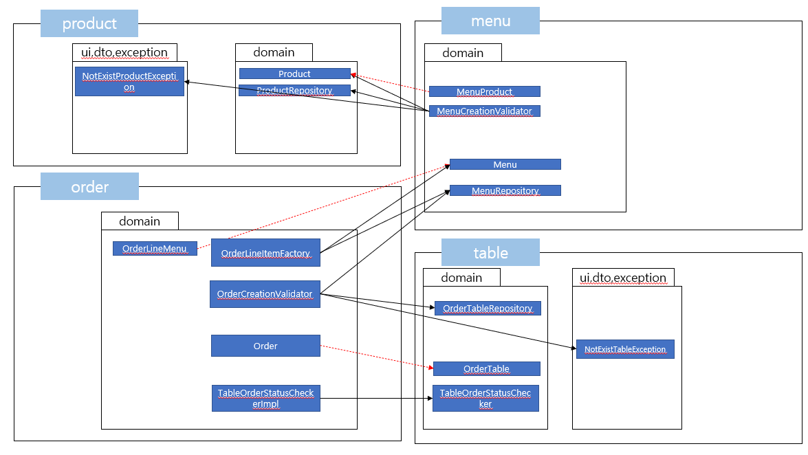
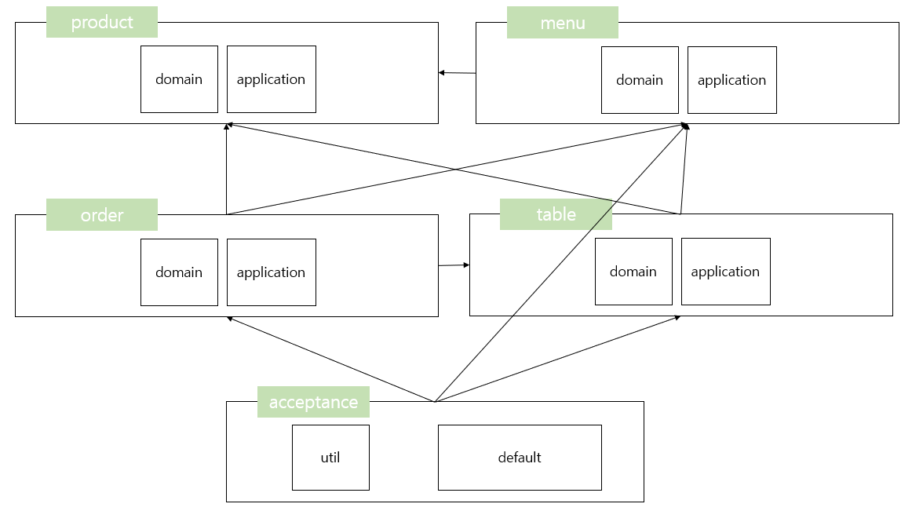

# 미션 진행기록 
## kitchenpos 도메인 초기 분석
### 상품
  - 상품, 상품가격
### 메뉴
  - 메뉴, 메뉴그룹, 메뉴상품, 메뉴가격
### 주문
  - 주문, 주문상태, 메뉴수량, 주문금액, 방문한 손님 수, 주문 항목, 매장 식사
### 테이블
  - 주문 테이블, 빈 테이블, 단체 지정
  
## 요구사항
### 1단계
- kitchenpos 패키지의 코드를 보고 키친포스의 요구 사항을 README.md에 작성한다.
- 키친포스의 요구 사항을 토대로 테스트 코드를 작성한다.
  - 모든 Business Object에 대한 테스트 코드를 작성한다.
  - @SpringBootTest를 이용한 통합 테스트 코드 또는 @ExtendWith(MockitoExtension.class)를 이용한 단위 테스트 코드를 작성한다.
- Lombok 없이 미션을 진행한다.

### 2단계
- 단위 테스트하기 어려운 코드와 단위 테스트 가능한 코드를 분리해 단위 테스트 가능한 코드에 대해 단위 테스트를 구현한다.

### 3단계 
- 메뉴 정보가 변경되더라도 주문 항목이 변경되지 않게 구현한다.
- 클래스 사이, 패키지 사이의 의존 관계는 단방향이 되도록 해야 한다.

## 리뷰 반영
### 2단계
- [X] JPA Entity 생성자의 접근 범위 정정 
- [X] 일급 콜렉션 적용
  - [X] MenuProducts
  - [X] OrderLineItems
  - [X] OrderTables
- [X] 테스트 코드에 assertAll 적용
- [X] 메뉴 컨텍스트에서 주문 컨텍스트의 관심사 제거 (validateAllMenusExist)
- [X] 테이블 컨텍스트에서 주문 컨텍스트의 관심사 제거 (validateTableToMakeOrder)
- [X] Menu 생성 로직 개선 및 불필요한 의존성 제거
  - [X] 메뉴 생성 중 가격 검증 과정에서의 비효율 제거
  - [X] Menu 엔티티에서 Product 의존성 제거

### 3단계 
- [X] 테스트 코드에만 영향을 받는 프로덕션 코드 변경 
- [X] Menu에 대한 검증 후 Menu가 생성되도록 변경
- [ ] 테스트 코드에서 Reflection으로 Dto 생성하는 부분 수정

## 작업목록
### 1단계
- [X] 키친포스 요구사항 작성 
- [X] 안정적인 리팩토링을 위한 테스트 코드 작성
  - [X] 응용 Service 테스트
  - [X] 시나리오 기반 인수테스트 작성  

### 2단계 
- [X] Spring Data JPA 의존성 추가
- [X] 응용서비스에서 도메인 로직을 분리
  - [X] Menu Domain Context > MenuGroup
    - [X] 패키지 생성 및 기존 클래스 이동
    - [X] JPA Entity로 변경 및 JPARepository 생성
    - [X] 응용서비스에서 도메인레이어로 로직 이동 (with 단위테스트 작성)
  - [X] Product Domain Context > Product
    - [X] 패키지 생성 및 기존 클래스 이동
    - [X] JPA Entity로 변경 및 JPARepository 생성
    - [X] 응용서비스에서 도메인레이어로 로직 이동 (with 단위테스트 작성)
  - [X] Menu Domain Context > Menu, MenuProduct
    - [X] 기존 클래스 이동
    - [X] JPA Entity로 변경 및 JPARepository 생성
      - Menu, MenuProduct는 양방향 1:N, N:1 관계
      - Menu, MenuGroup은 단방향 N:1 관계
    - [X] 응용서비스에서 도메인레이어로 로직 이동 (with 단위테스트 작성)
  - [X] Table Domain Context > OrderTable, TableGroup
    - [X] 패키지 생성 및 기존 클래스 이동
    - [X] 요청/응답을 위한 DTO 작성
    - [X] JPA Entity로 변경 및 JPARepository 생성
    - [X] 응용서비스에서 도메인레이어로 로직 이동 (with 단위테스트 작성)
    - [X] 단위테스트 추가 작성
  - [X] Order Domain Context > Order, OrderLineItem, OrderStatus
    - [X] 패키지 생성 및 기존 클래스 이동
    - [X] 요청/응답을 위한 DTO 작성
    - [X] JPA Entity로 변경 및 JPARepository 생성
    - [X] 응용서비스에서 도메인레이어로 로직 이동 (with 단위테스트 작성)
- [X] 리팩토링
  - [X] 도메인 의미를 담은 사용자정의 예외 작성
  - [X] 타 컨텍스트에서 Order 컨텍스트에 대한 의존성 제거

### 3단계 
- [X] 이전 단계 리뷰 반영
  - [X] 테스트 코드 내 프로덕션 로직 중복 제거 (MenuCreationValidator로 검증 로직 위치 변경 후 테스트)
- [X] 메뉴 정보가 변경되더라도 주문 항목이 변경되지 않게 구현
  - [X] flyway 버전 추가(orderLineItem 테이블에 메뉴이름과 메뉴가격 컬럼을 추가)
  - [X] OrderLineItem 객체 생성시점에 메뉴 정보를 복사 
- [X] 프로덕션 및 테스트 코드 의존성 분석 및 조치
  - [X] 프로덕션 의존성 구성도 작성
  - [X] 테스트 코드 분리
    - [X] ServiceTestHelper를 각 패키지로 분리
    - [X] Fixtures를 각 패키지로 이동
    - [X] KitchenPosBehaviors는 인수테스트 패키지 내부로 이동
  - [X] 테스트 의존성 구성도 작성
  - [X] order-table 테스트 코드 패키지간 양방향 의존성 제거
- [X] 테스트 코드 리팩토링
  - [X] ㅇㅇㅇApplicationBehavior -> ㅇㅇㅇContextServiceBehavior로 이름 변경 및 위치 이동
  - [X] 도메인 객체 픽스처 팩토리 추가(기존 픽스처 팩토리는 DtoFixtureFactory로 이름 변경 및 위치 이동)
    - [X] Table
    - [X] Product
    - [X] Menu
    - [X] Order

## 의존성 구성도 첨부
### 프로덕션 코드

### 테스트 코드 (컨텍스트 단위)

